# Notice d'utilisation

L'objectif de ce projet est de mettre à disposition du public les données des capteurs présents dans les différents bâtiments, à travers des QRCodes.  
Toutes les interfaces sont situées sur un site web.

## Affichage des données

Cette page est visible par n'importe qui, elle est accessible à l'aide des QRCodes présents sur les capteurs.

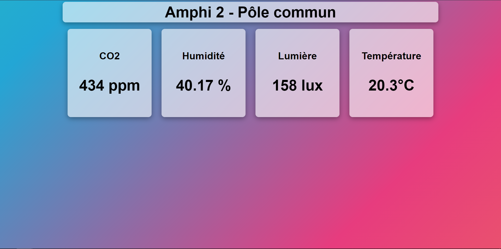

Sont affichées la salle où se trouve le capteur ainsi que ses données.  
Tous ces paramètres sont configurables.

## Connexion

Pour accéder à la page de configuration, il faut au préalable passer par une page d'authentification en renseignant le mot de passe administrateur.
Mot de passe par défaut: `admin`.

## Configuration

Cette page est uniquement accessible par authentification.
Toutes les configurations sont instantanées, il n'y a pas de bouton de validation.

### Gestion des QRCodes

La configuration des QRCodes se fait sur l'onglet `QRCodes`.  
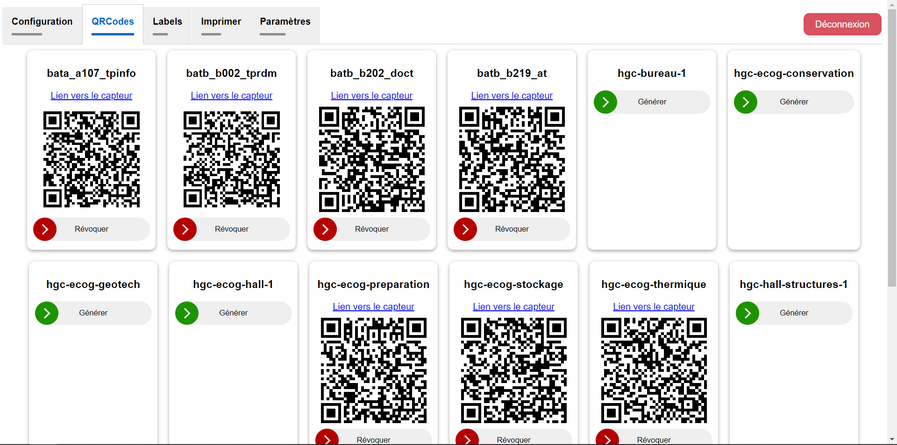

La page d'affichage des données n'est en aucun cas accessible si le capteur n'a pas de QRCode associé.  
La création d'un QRCode se fait via le bouton `Générer`.  
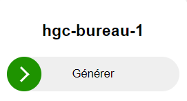

Une fois généré, le QRCode apparaît avec un lien menant directement à la page d'affichage des données.  
Ce lien et le QRCode redirigent vers la même page.
Si le besoin de révoquer un QRCode se ressent, c'est-à-dire de le rendre inutilisable, il faut utiliser le bouton `Révoquer`.  
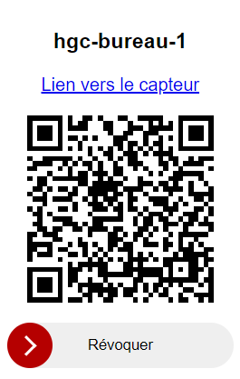

Cette action ouvre une fenêtre de confirmation, dans le cas où ce bouton est appuyé par erreur.  
S'il est révoqué, les QRCodes qui ont été imprimés ne seront plus utilisable.  


### Capteurs

La configuration du nom du capteur et les données affichées se fait sur l'onglet `Configuration`.

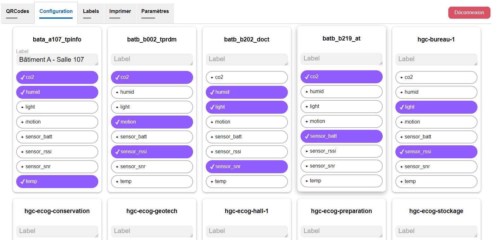

#### Nom du capteur

Le nom est modifiable dans le champ `Label`.  
 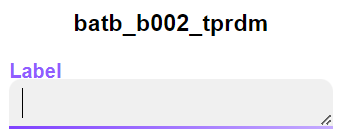

L'indication que le nom est modifié est indiqué avec une barre rouge.  
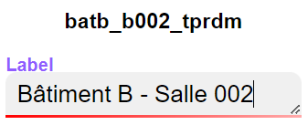

Si l'on quitte le champ texte sans valider, le nom n'est pas modifié et revient à la valeur de départ.  
Pour valider la modification, il faut appuyer sur la touche _Entrée_.  
Si le serveur a bien pris en compte la modification, la barre d'indication devient verte.  
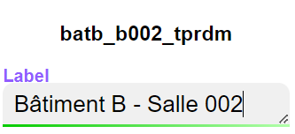

#### Données affichées

Pour configuration les données affichées à l'utilisateur, il suffit de cliquer sur les boutons.  
Un bouton violet signifie que la donnée est affichée, le bouton blanc indiquant l'inverse.  
Par exemple, le CO2 sera affiché contrairement à l'humidité.  
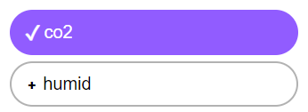

### Labels des données

Par défaut, une donnée est affichée avec comme titre un type de donnée brut et sa valeur.  
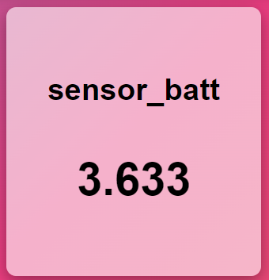

La configuration de cet affichage se fait dans l'onglet `Labels`.  
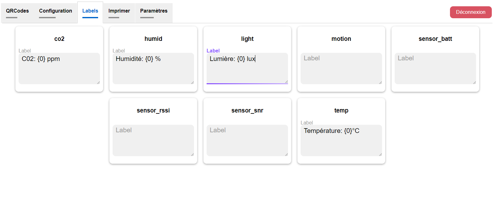

Pour spécifier un label, il y a quelques règles à respecter pour un affichage optimal :

- Le nom et la donnée sont séparés par un double point `:`
- La donnée est spécifiée par les symboles `{0}`

Comme pour les labels des capteurs, un indicateur est présent lorsque le label est modifié.  
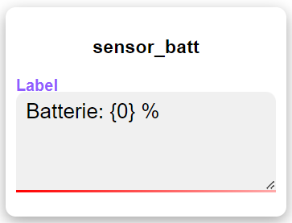

De même, il faut appuyer sur _Entrée_ pour valider.  
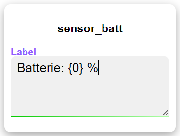

### Impression

> L'impression des QRCodes est sensible à l'hôte, ne les imprimez pas si vous accédez au site via un hôte inaccessible au public, comme `localhost`.

Les QRCodes générés peuvent être imprimés via l'onglet `Imprimer`.  


Pour sélectionner les QRCodes à imprimer, sélectionnez-les en cliquant dessus.  
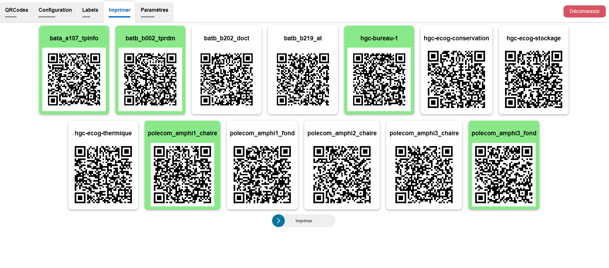

Ensuite, cliquez sur le bouton `Imprimer`, la fenêtre d'impression du navigateur s'ouvre alors.  
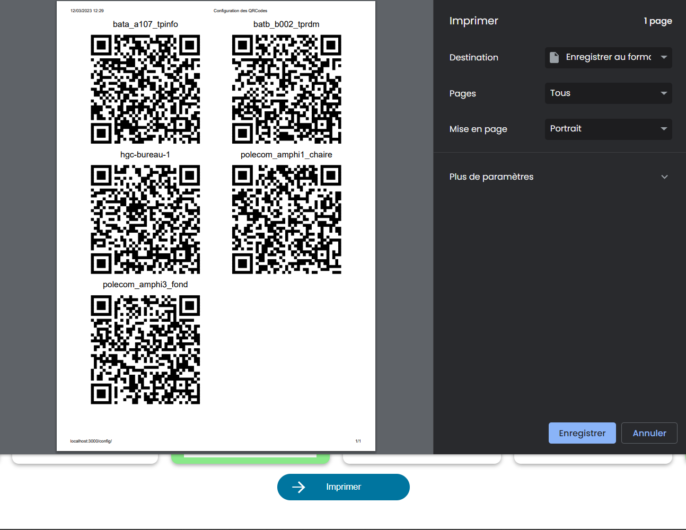

Les QRCodes sont regroupés en deux colonnes et trois lignes, ce qui en donne six par pages.  
Cette disposition est configurable dans une certaine mesure selon les paramètres d'impression du navigateur.  
On peut par exemple modifier leur taille ou encore en fusionner les pages.

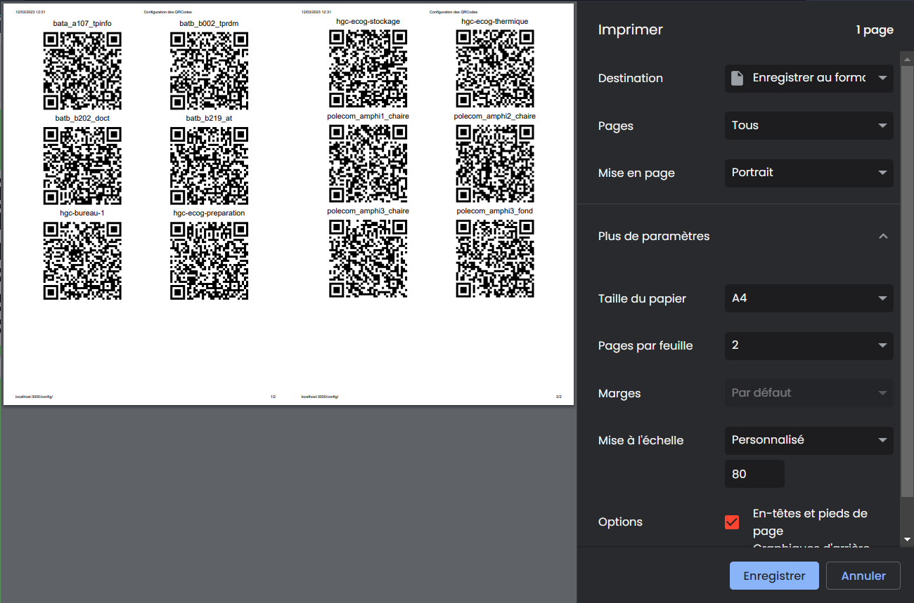

### Paramètres

Certains paramètres techniques de l'application sont modifiables via l'onglet `Paramètres`.  
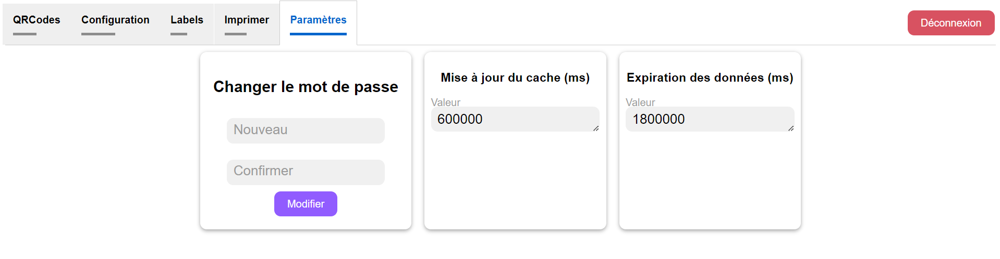

Sur cet onglet, on peut notamment modifier le mot de passe administrateur.  
Les autres paramètres concernent des paramètres numériques :

- Mise à jour du cache : Valeur en millisecondes. Les données des capteurs sont mises en cache pour éviter d'inonder la base de données de requête en un court laps de temps. Ce paramètre indique le délai avant de mettre les données à jour.
- Expiration des données: Valeur en millisecondes. Si un capteur cesse de fonctionner, ces données ne sont plus mises à jour et affichent des données qui ne représentent pas l'état actuel de la salle, ce qui peut induire en erreur. Cette valeur indique au bout de combien de temps les données sont marquées comme expirées.

Comme pour les labels, un indicateur est présent.  
Les valeurs étant numériques, si le format est invalide, la donnée n'est pas validée et revient à son état initial.

# Documentation technique

## Base de données

Pour cette application, deux bases de données sont utilisées.  
Celle contenant les données des capteurs appartient à Polytech.  
Celle contenant les données de configuration comme les labels et les types de données affichés est une base locale utilisant SQLite et est contenu dans un unique fichier.
Cette dernière contient notamment les IDs des capteurs générés pour associer un capteur à un QRCode.

Cela peut être utile, si par exemple des QRCodes ont été révoqués accidentellement et qu'ils sont déjà imprimés.
On peut alors, si on possède des sauvegardes de cette base de données, remettre les IDs associés à ses QRCodes (champ `url_id`).  
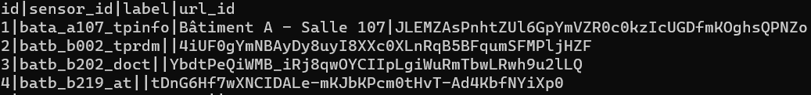

## Paramètres

Les paramètres de l'application sont enregistrés dans un fichier `config.json`.
On y retrouve les paramètres modifiables directement sur le site, le mot de passe hashé de l'administrateur ainsi que d'autres paramètres.
En dehors du mot de passe, tous les paramètres ayant un champ `label` sont affichés sur le site.
On peut donc faire en sorte qu'ils apparaissent en modifiant ce fichier.

```json
{
  "updateInterval": {
    "label": "Mise à jour du cache (ms)",
    "value": 600000
  },
  "expirationTime": {
    "label": "Expiration des données (ms)",
    "value": 1800000
  },
  "tokenExpirationTime": 1800000,
  "deleteTokenInterval": 86400000,
  "adminPassword": "8c6976e5b5410415bde908bd4dee15dfb167a9c873fc4bb8a81f6f2ab448a918"
}
```

Le paramètre `tokenExpirationTime` indique au bout de combien de temps une session est expirée, en millisecondes.  
Le paramètre `deleteTokenInterval` indique l'intervalle de suppression des tokens d'authentification non supprimés, pour éviter d'utiliser de la mémoire inutilement, en millisecondes.

## Environnement

Un fichier `.env` est présent pour indiquer les paramètres de connexion de la base de données des données des capteurs.

```env
INFLUXDB_HOST=
INFLUXDB_PATH=
INFLUXDB_USERNAME=
INFLUXDB_PASSWORD=
INFLUXDB_DATABASE=
```

## Docker

L'application est lancée dans un conteneur Docker.  
Les paramètres sont situés dans le fichier `docker-compose.prof.yml`.

La base de données de configuration est contenue dans un volume pour assurer sa persistance.
Les fichiers `config.json`, `certificate.crt` et `private.key` doivent être présents sur la machine hôte et sont bindés.
Si les fichiers sont nommés autrement, il faut les modifier dans le fichier `docker-compose.prof.yml`.

## Changement de mot de passe

En plus de pouvoir modifier le mot de passe sur le site, un script `changePassword.sh` a été ajouté pour permettre de le modifier sans passer par le site.  
Cela peut être utile si jamais le mot de passe a été volé et modifié par un tiers.

# Utilisation

Tout se fait via le `makefile`.  
Il faut commencer par faire un `make init`. Cela aura pour effet de créer un fichier `.env` et un fichier `config.json` à partir des samples présents dans le git. Il lancera le script de changement de mot de passe administrateur. Cela permet de changer le mot de passe par défaut.

Ensuite il faudra venir définir les variables d'environnement de votre `.env` et pourquoi pas éditer votrer configuration dans `config.json` (facultatif).

Il faut s'assurer d'avoir Docker et Docker compose. Le développement a été réalisé avec Docker 20.10.

Il faut absolument avoir un fichier `private.key` et `certificate.crt`. Ces fichiers sont utiles pour la connexion HTTPS. Ils peuvent être vides, autosignés ou bien reconnus par une autorité de certification. Si les fichiers sont vides, l'application basculera automatiquement sur HTTP.

Enfin, vous pouvez lancer le conteneur Docker avec `make`. Cette commande va construire le conteneur puis l'exécuter.

Voici une liste des autres commandes possibles :

- `make build`: construit le conteneur;
- `make up`: exécute les services contenus dans le conteneur;
- `make down`: stop les services lancés;
- `make restart`: stop et redémarre les services du conteneur;
- `make password`: change manuellement le mot de passe; administrateur, puis redémarre les services.
